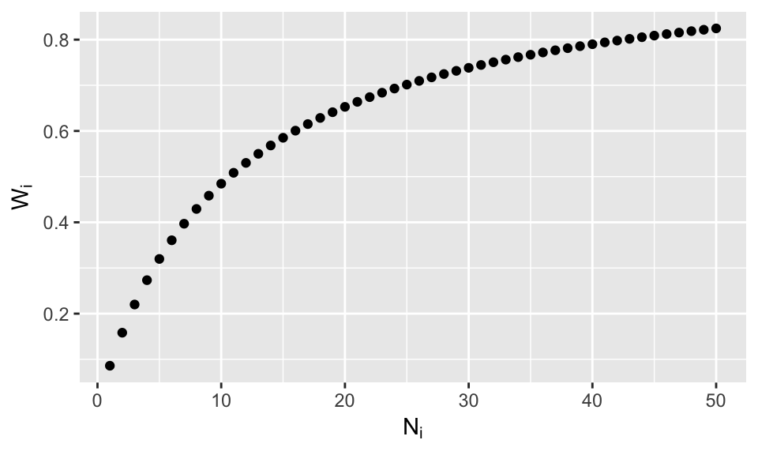
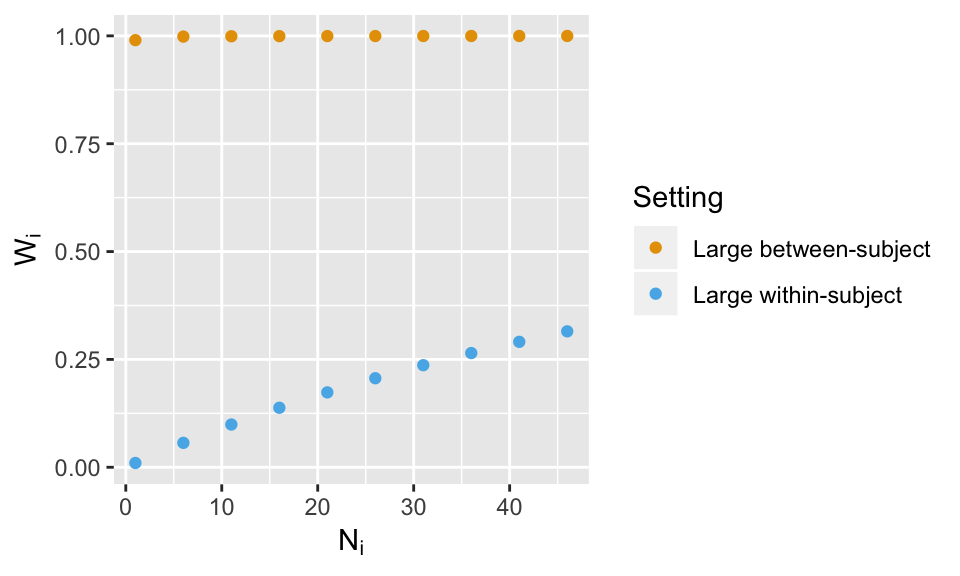

# V5: Conditional modes vs means

## Relationship between mixed model conditional modes (aka BLUPS) and OLS estimates {.unlisted}

## Introduction

This chapter accompanies the fifth video in the mixed models series,   ["Relationship between mixed model conditional modes (aka BLUPS) and OLS estimates"](https://youtu.be/QqEUKlKPos4).
In the last chapter, mixed models were contrasted to using the two-stage summary statistics model (2SSS) focusing on the regularization that is built into mixed models.  Specifically, the ordinary least squares (OLS) estimates from stage 1 of 2SSS were compared to the conditional mode-based subject predictions from mixed models to show the regularization of the estimates, within-subject, in the mixed model setting.  Although the conditional mode predictions are not perfect, that exploration will be started in the next segment.  Here the focus is on the details of the relationship of the OLS estimates and the conditional mode   estimates as there is an equation that describes this relationship!  Why is this exciting?  Because it helps build intuition about when these two approaches will greatly differ.  I will be briefly discussing this equation below, but for more technical details see section 8.7 of the [Applied Longitudinal Analysis text by Fitzmaurice and others](https://www.amazon.com/Applied-Longitudinal-Analysis-Garrett-Fitzmaurice/dp/0470380276). 

I will stick with the simplified example from last time, where there are multiple measures of reaction time for each subject and the interest is in the mean. Here's a reminder of how the data were generated (exactly the same code as last time and seed is fixed so same numbers are generated):


```r
library(lme4)
library(lmerTest)
library(ggplot2)
set.seed(1850)  # This is simply fixing the seed so the code always gives the same result.  
#Obviously omit this if you are running new simulations

# Simulate true subject-specific means:
nsub = 10
btwn.sub.sd = 10
#within-subject means
win.means = rnorm(nsub, mean = 250, sd = btwn.sub.sd)

# Simualte data for each subject by wiggling around their means
win.sub.sd = 20
# The following indicates how many data per subject, the first 5 only have 5 observations.
n.per.sub = rep(50, nsub)
n.per.sub[1:5] = 5
rt = c()
subid = c()
for (i in 1:nsub){
  rt.loop = rnorm(n.per.sub[i], win.means[i], sd = win.sub.sd)
  rt = c(rt, rt.loop)
  subid = c(subid, rep(i, n.per.sub[i]))
}
dat = data.frame(subid, rt)
```


## The equation for shrinkage

As a reminder, the formula for the mixed model is: $$Y_i = X_i\beta + A_ib_i + \epsilon_i. $$ With the data setup for this chapter,  $Y_i$ is a vector of reaction times for subject $i$, $X_i = Z_iA_i$ simplifies to $Z_i$, since we are only estimating an average over subjects.  Since we are also only estimating a within-subject average,  $Z_i$ is simply a column of 1s with length $N_i$, the number of observations for subject $i$. The random effect, $b_i$, is of length 1 since only a random intercept in necessary.  Specifically, $b_i\sim N(0, G)$, where $G$ is a scalar, and $\epsilon_i$ describes the within-subject variability, $\epsilon_i \sim N(0, \sigma^2I_{N_i})$. If needed, review the more detailed explanation of these matrices and vectors from previous lessons.


The following are what we need to focus on and I quickly relate the parameters to the output of the code below, which is repeated code from the last lesson.

* $\hat\beta$:  The fixed effects (group) estimate of the mean from the mixed model.  This is the estimated group intercept, 253.88 below.
* $\hat\beta_i$: The conditional mode, predicted value for subject $i$ from the mixed model.  These values are stored in the mmcm vector created with the coef function below.
* $\hat\beta_i^{OLS}$:  The OLS-based estimate from stage 1 of 2SSS, $Y_i = Z_i\beta_i^{OLS} + \gamma_i.$  These are stored in the stage1.est vector below.
* $N_i$: the number of data points for subject $i$.  For now this is 5 for the first 5 subjects and 50 for the second 5 subjects.
* $G$ and $\sigma^2$:  Between-subject variance/covariance matrix and within-subject variance.  In this case we'll work with the estimates which are $G=6.309^2$ and $\sigma^2 = 20.577^2$ and stored in vcov.vals.  Find them in the mixed model output below.


```r
# Stage 1
stage1.est = rep(NA, nsub)
for (i in 1:nsub){
  # Estimating the mean RT via linear regression
  mod.loop = lm(rt ~ 1, dat[dat$subid==i,])
  stage1.est[i] = mod.loop$coef[1]
}
mod.lmer = lmer(rt ~ 1 + (1|subid), dat)
summary(mod.lmer)
```

```
## Linear mixed model fit by REML. t-tests use Satterthwaite's method [
## lmerModLmerTest]
## Formula: rt ~ 1 + (1 | subid)
##    Data: dat
## 
## REML criterion at convergence: 2449.6
## 
## Scaled residuals: 
##      Min       1Q   Median       3Q      Max 
## -2.54753 -0.69671  0.02651  0.72996  2.80661 
## 
## Random effects:
##  Groups   Name        Variance Std.Dev.
##  subid    (Intercept)  39.81    6.309  
##  Residual             423.42   20.577  
## Number of obs: 275, groups:  subid, 10
## 
## Fixed effects:
##             Estimate Std. Error      df t value Pr(>|t|)    
## (Intercept)  253.885      2.638   6.206   96.25 4.35e-11 ***
## ---
## Signif. codes:  0 '***' 0.001 '**' 0.01 '*' 0.05 '.' 0.1 ' ' 1
```

```r
mmcm = coef(mod.lmer)$subid[, 1]
vcov.vals = as.data.frame(VarCorr(mod.lmer)) #random effects values
beta.hat = summary(mod.lmer)$coefficients[1]
```


  If one is interested in the derivation of the relationship between $\hat\beta_i$ and $\hat\beta_i^{OLS}$, see section 8.7 of the [Applied Longitudinal Analysis text by Fitzmaurice and others](https://www.amazon.com/Applied-Longitudinal-Analysis-Garrett-Fitzmaurice/dp/0470380276).  The end result is: $$\hat\beta_i = W_i\hat\beta_i^{OLS}+(I_q-W_i)A_i\hat\beta,$$
where $q$ is the dimension of G and $$W_i= G\{G+\sigma^2(Z_i'Z_i)^{-1}\}^{-1}.$$
Before tackling what $W_i$ is, exactly, focus on the general structure of the relationship assuming $A_i$ is the identity matrix (more on this in a future lesson).   If the weight, $W_i$, is very small, then what counts the most toward the estimate of $\hat\beta_i$ is the fixed effects estimate of $\beta$.  From the last lesson you might suspect that $W_i$ will be small when a subject has less data, since that's when more regularization was present.  On the other hand, if $W_i$ is very large, the conditional mode-based estimate from the mixed model will look very similar to the within-subject estimate from the first stage of 2SSS, which is what we saw for the subjects who had more data in the last lesson.  

Let's test that theory by deriving $W_i$ for our specific model.  Recall $Z_i$ is just a column of 1s of length $N_i$, so $(Z_i'Z_i)^{-1} = 1/N_i$ and $G$ is just a scalar (between-subject variance of the mean), so we have: $$W_i  = \frac{G}{G+\sigma^2/N_i}=\frac{6.31^2}{6.31^2+20.58^2/N_i}.$$

Now it is crystal clear that our suspicions from the last lesson are true: for small $N_i$ the overall weight will be small, favoring $\hat\beta$ and if $N_i$ is large, the overall weight will be large, favoring $\hat\beta^{OLS}_i$.  Here's a plot of the weight as a function of $N_i$


```r
Ni.plot = 1:50
Wi.plot = vcov.vals[1,4]/(vcov.vals[1,4] + vcov.vals[2,4]/Ni.plot)
datplot = data.frame(Ni.plot, Wi.plot)
ggplot(datplot, aes(x=Ni.plot, y =Wi.plot)) + geom_point() +labs(y=expression(W[i]), x = expression(N[i]))
```



Granted things will be more difficult if the model has a slope and an intercept (when G is a matrix) and when between-subject variables are included ($A_i$ will not be the identity), but we will deal with that later.

## Verifying coef.lmer is following the equation

Although it is satisfying to find this equation it is only fully satisfying if that is what lmer is doing when we ask for the conditional modes.  The following verifies this for each subject. 


```r
Wi = vcov.vals[1,4]/(vcov.vals[1,4] + vcov.vals[2,4]/n.per.sub) 
# See first code chunk for n.per.sub
cond.mode.est = Wi*stage1.est + (1-Wi)*beta.hat

# Stack my estimates on top of lmer's conditional model estimates
rbind(cond.mode.est, mmcm)                     
```

```
##                   [,1]     [,2]     [,3]    [,4]     [,5]     [,6]     [,7]
## cond.mode.est 256.9017 251.9737 247.7054 251.652 250.0628 260.2288 248.4464
## mmcm          256.9017 251.9737 247.7054 251.652 250.0628 260.2288 248.4464
##                   [,8]     [,9]    [,10]
## cond.mode.est 256.1146 261.2941 254.4678
## mmcm          256.1146 261.2941 254.4678
```

Satisfying, isn't it?  

What do you think will happen if the within-subject variance is smaller, which is more typical?  Will the weights vary as much?  No need to re-simulate data, just plug in values for $G$ and $\sigma^2$ and plot the weights as shown below.


```r
# Large within-subject variance with respect to between-subject variance (go bold or go home)
Ni.plot = seq(1, 50, 5)

Wi.plot.large.within = 1/(1 + 100/Ni.plot)

# Large between-subject variance with respect to within-subject variance
Wi.plot.large.between = 100/(100 + 1/Ni.plot)

Wi.all = c(Wi.plot.large.within, Wi.plot.large.between)
Setting = rep(c("Large within-subject", "Large between-subject"), each = length(Ni.plot))
Ni.all = c(Ni.plot, Ni.plot)
datplot2 = data.frame (Wi.all, Ni.all, Setting)
cbPalette <- c("#E69F00", "#56B4E9", "#009E73", "#F0E442", "#0072B2", "#D55E00", "#CC79A7","#999999")

ggplot(datplot2, aes(x=Ni.all, y =Wi.all, color = Setting)) + geom_point() +labs(y=expression(W[i]), x = expression(N[i]))+ scale_colour_manual(values=cbPalette)
```




## Summary 

The settings in the above were pretty dramatic, but do show the 2SSS approach will likely be very similar to the mixed model result if the between-subject variance is large with respect to the size of the within-subject variance.  Further, the weights will vary most across subjects if the sample sizes vary wildly.  I would like to highly encourage the reader to run the above code with more settings to see how the weights change.

In the next chapter we will study the group results in more detail, but where the goal isn't a single group mean, but the difference in means between two groups.  Does the 2SSS still work okay is most situations?  What if one group has generally less data per subject than the other group?  Can that cause false positives or reduced power in the mixed model result?  What if we use the conditional modes in an analysis?  Does that work okay?  All of these questions will be addressed in the next chapter.
